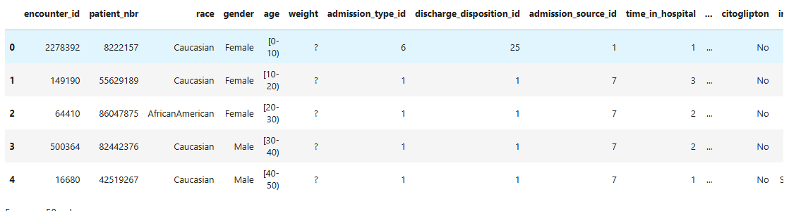
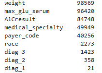
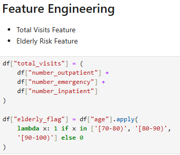
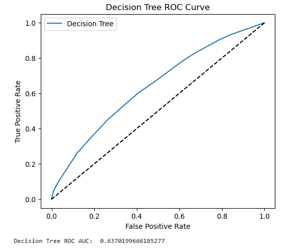

# Hospital Readmission Risk Prediction

## Background and Overview

Hospital readmissions among diabetes patients remain a persistent operational and clinical challenge, often indicating gaps in discharge planning, follow-up care, or chronic disease management. Diabetes is associated with complex comorbidities and recurrent hospital utilization, making early risk identification particularly valuable for improving patient outcomes and reducing avoidable healthcare costs.  

This project develops baseline machine learning models to estimate the likelihood of 30-day readmission among diabetic patients using structured hospital encounter data. The goal is to demonstrate a complete healthcare data science workflow — from preprocessing and feature engineering to predictive modeling and evaluation — while producing interpretable insights that reflect real-world clinical complexity.

---

## Data Structure Overview

The dataset originates from the **UCI Machine Learning Repository – Diabetes 130-US Hospitals dataset**, containing over **101,000 inpatient encounters** collected from multiple hospitals across the United States. The dataset includes approximately **50 structured variables** spanning demographics, admission characteristics, diagnoses, laboratory indicators, medications, and prior healthcare utilization.  

Variables capture both clinical and administrative aspects of each encounter, enabling analysis of patterns associated with early readmission risk. The original readmission variable was transformed into a binary outcome indicating whether a patient was readmitted within 30 days, allowing for supervised predictive modeling.

---

## Technical Stack

- Python  
- Pandas & NumPy  
- Scikit-learn  
- Matplotlib & Seaborn  
- Jupyter Notebook  

Modeling approaches included Logistic Regression as a baseline linear classifier and a Decision Tree model to capture potential non-linear relationships and provide interpretable feature importance. The workflow covered data cleaning, missing value handling, feature engineering, model training, ROC-based evaluation, and export of prediction outputs for further analysis.

---

## Executive Summary

This project applied machine learning techniques to estimate 30-day readmission risk among hospitalized diabetes patients using structured clinical encounter data. After preprocessing and feature engineering, two baseline models — Logistic Regression and Decision Tree — were trained to establish initial predictive performance and identify key risk patterns.  

The dataset displayed strong class imbalance, with early readmissions representing roughly eleven percent of all encounters. This imbalance influenced model evaluation, making ROC AUC a more meaningful performance metric than accuracy alone. Logistic Regression achieved an ROC AUC of approximately **0.64**, while the Decision Tree model achieved approximately **0.63**, indicating modest predictive discrimination consistent with many real-world healthcare datasets.  

Although predictive performance was moderate, the modeling pipeline demonstrates a reproducible workflow for healthcare risk modeling. The results highlight both the challenges of predicting clinical outcomes using structured administrative data alone and the importance of integrating additional patient context for improved accuracy.

---

## Insights Deep Dive

Historical healthcare utilization emerged as one of the most influential predictors of early readmission risk. Patients with multiple prior inpatient, outpatient, or emergency visits showed higher likelihood of returning within 30 days, suggesting that frequent healthcare engagement may reflect underlying clinical complexity or insufficient post-discharge continuity of care.  

Age-related patterns also appeared significant, particularly among older patient groups. Elderly patients exhibited elevated risk profiles, which may be associated with comorbid conditions, medication management challenges, and increased vulnerability following discharge. Feature engineering steps that captured age categories and aggregated visit counts contributed meaningfully to risk stratification.  

Model interpretation further revealed that structured clinical variables alone provide limited predictive separation. The relatively modest ROC AUC values indicate that many drivers of readmission risk likely exist outside traditional hospital administrative datasets, such as social determinants of health, outpatient adherence, and patient support systems.  

The decision tree feature importance analysis reinforced these observations by emphasizing utilization history and demographic risk indicators over laboratory values or individual diagnosis codes. This suggests that patient behavior patterns and care pathways may be as important as clinical measurements in predicting short-term readmission risk.

---

## Recommendations

Hospitals should prioritize proactive follow-up and care coordination for patients with repeated prior encounters, as utilization history appears strongly associated with early readmission risk. Identifying these patients early may enable targeted interventions such as discharge education, remote monitoring, or scheduled outpatient follow-ups.  

Future predictive modeling efforts should incorporate broader contextual data — including social determinants, medication adherence metrics, and outpatient engagement — to improve model discrimination. Ensemble learning approaches and class balancing techniques may also enhance predictive performance beyond baseline models.  

Finally, even moderately performing models can support operational decision-making by serving as early risk screening tools within clinical dashboards. When combined with clinician judgment and additional patient information, such tools can contribute to more informed discharge planning and resource allocation strategies.
